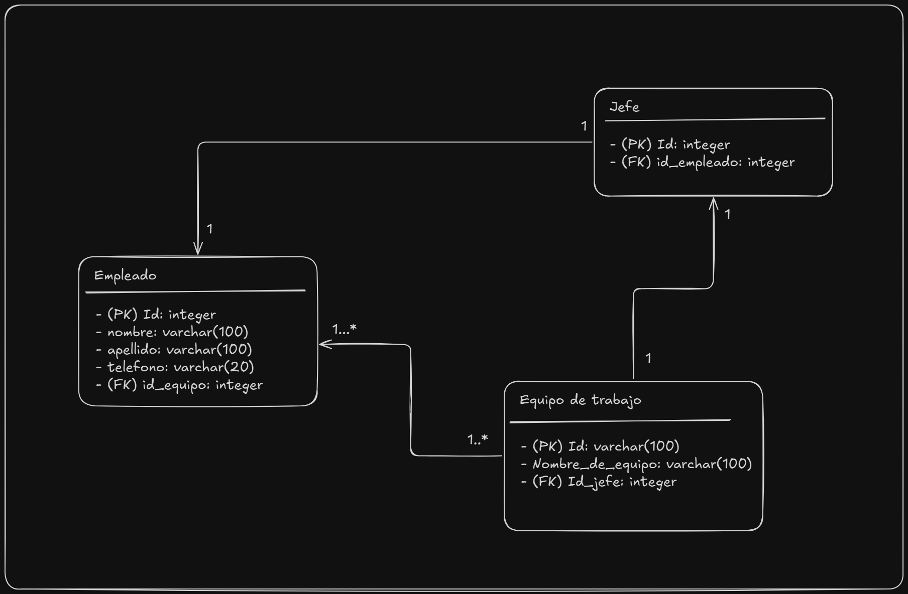

# Módulo 10 - Acceso a base de datos

En este módulo, se aprenderá a integrar aplicaciones Java con bases de datos relacionales utilizando JDBC. Se explorarán los conceptos fundamentales de SQL y el diseño de bases, la configuración de drivers y la conexión a la base de datos, así como la ejecución de consultas y actualizaciones mediante Statement y PreparedStatement.
Además, se profundizará en la gestión de transacciones (commit, rollback e índices de aislamiento) y en la implementación de buenas prácticas y medidas de seguridad para prevenir vulnerabilidades como la inyección SQL, optimizando así el rendimiento de las aplicaciones.h

## Ejercicio SQL

Utilizando la herramienta [SQLITE online](https://sqliteonline.com/) crear la siguiente base de datos



```sql
INSERT INTO Empleado (id, nombre, apellido, telefono) VALUES
(3001, 'Juan', 'Pérez', '099123456'),
(2961, 'María', 'González', '094876543'),
(3649, 'Pedro', 'Rodríguez', '092334455'),
(2148, 'Laura', 'Fernández', '098223344'),
(3539, 'Diego', 'Martínez', '093556677'),
(1858, 'Sofía', 'López', '091778899'),
(2000, 'Martín', 'Castro', '097445566'),
(4881, 'Valentina', 'Suárez', '095667788'),
(3099, 'Nicolás', 'Pereira', '099332211'),
(3489, 'Camila', 'Cabrera', '094998877'),
(4074, 'Andrés', 'Varela', '098112233'),
(1152, 'Lucía', 'Morales', '091223344'),
(2969, 'Franco', 'Silva', '097556677'),
(1478, 'Julieta', 'Romero', '095889900'),
(2819, 'Tomás', 'Domínguez', '092778899');

INSERT INTO Jefe (id, id_empleado) VALUES 
(1766, 2969),
(3188, 1478),
(1912, 2819);

INSERT INTO EquipoDeTrabajo (id, nombre, id_jefe) VALUES 
(2202, 'equipo1', 1478),
(2323, 'equipo2', 2969),
(3516, 'equipo3', 2819);

UPDATE Empleado SET id_equipo = 2202 WHERE id=1478;
UPDATE Empleado SET id_equipo = 2202 WHERE id=3001;
UPDATE Empleado SET id_equipo = 2202 WHERE id=2961;
UPDATE Empleado SET id_equipo = 2202 WHERE id=2148;
UPDATE Empleado SET id_equipo = 2202 WHERE id=3539;

UPDATE Empleado SET id_equipo = 2323 WHERE id=2969;
UPDATE Empleado SET id_equipo = 2323 WHERE id=1858;
UPDATE Empleado SET id_equipo = 2323 WHERE id=2000;
UPDATE Empleado SET id_equipo = 2323 WHERE id=4881;
UPDATE Empleado SET id_equipo = 2323 WHERE id=3099;

UPDATE Empleado SET id_equipo = 2202 WHERE id=2819;
UPDATE Empleado SET id_equipo = 2202 WHERE id=4074;
UPDATE Empleado SET id_equipo = 2202 WHERE id=1152;
UPDATE Empleado SET id_equipo = 2202 WHERE id=3489;
UPDATE Empleado SET id_equipo = 2202 WHERE id=3649;
```

```sql
-- consulta al empleado con id 2000
SELECT * from Empleado WHERE id = 2000;

--busca al empleado con el nombre lucia
SELECT * from Empleado WHERE nombre = 'Lucía';

--busca el teléfono y apellido de la tabla empleados con el nombre franco
SELECT telefono,apellido FROM Empleado WHERE nombre =  'Franco'

--busca el nombre y apellido de la tabla empleados (con el nombre e) por su id de jefe (con el nombre j)
SELECT e.nombre, e.apellido from Empleado as e,Jefe as j WHERE j.id_empleado = e.id and j.id = 3188

--busca los datos de los empleados de un equipo por su nombre de equipo
SELECT e.id, e.nombre, e.apellido, e.telefono, e.id_equipo, eq.nombre_equipo from Empleado as e, EquipoDeTrabajo as eq WHERE e.id_equipo = eq.id and eq.nombre_equipo = 'equipo1' 	
```